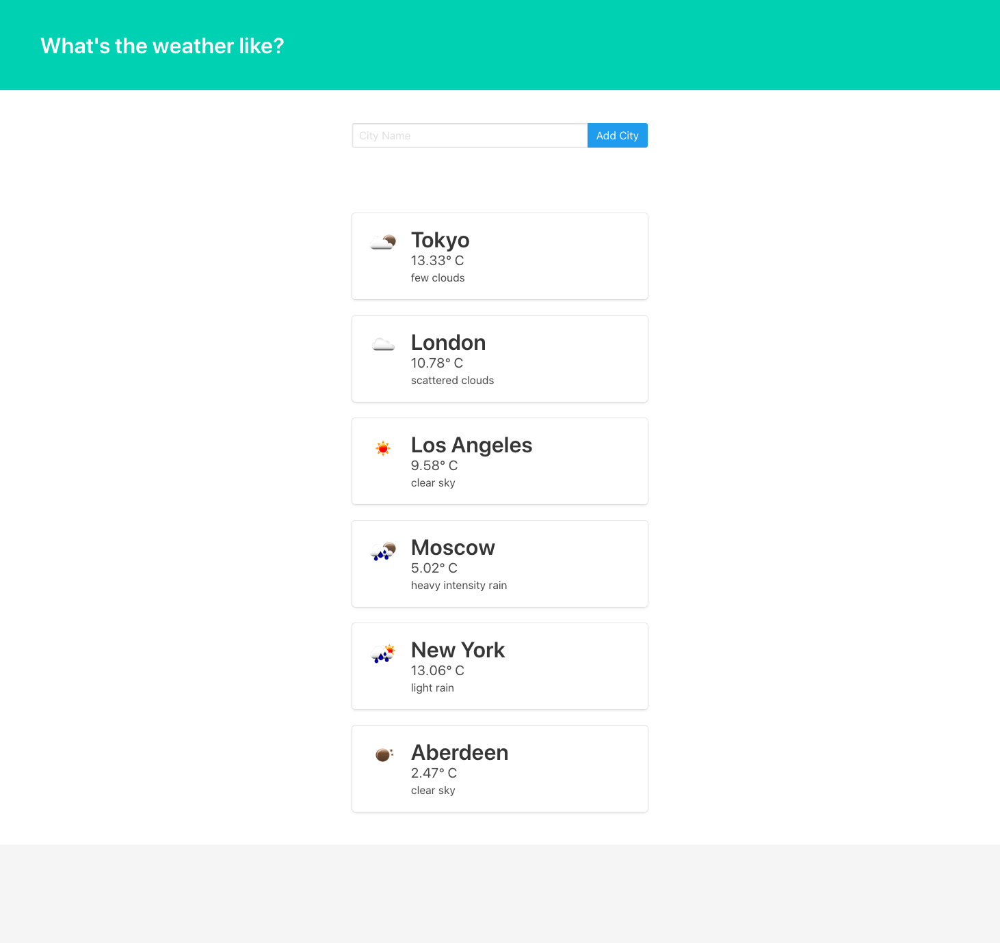

# Weather app in Django using Python Requests

Weather app in Django that gets the current weather for multiple cities. To do this, I used Python Requests to call the Open Weather Map API.

[](https://opensource.org/licenses/MIT) [](https://GitHub.com/Naereen/StrapDown.js/graphs/contributors/) [](https://github.com/ellerbrock/open-source-badges/) [](https://saythanks.io/to/kennethreitz)

[](https://www.python.org/)

[](https://GitHub.com/Naereen/)

## Demo


## Building

**Note:** In this project I've used Python 3.7, so you need to install it first. It's highly recommended to use `pyenv` for installation (if you're on MacOS).

It's best to use the python `pipenv` tool to build locally:

#### `$ pipenv --python python3`
#### `$ pipenv shell`
#### `$ pipenv install django requests autopep8`

## Start the project

#### `$ django-admin startproject the_weather`
#### `$ cd the_weather/`
#### `$ python manage.py startapp weather`

Open up the files in your editor and add app `weather` to the project within `the_weather/settings.py`:

```python
INSTALLED_APPS = [
    'django.contrib.admin',
    'django.contrib.auth',
    'django.contrib.contenttypes',
    'django.contrib.sessions',
    'django.contrib.messages',
    'django.contrib.staticfiles',
    'weather',
]
```
#### `$ python manage.py migrate`
#### `$ python manage.py createsuperuser --username=<your name> --email=<your email address>`

And then just startapp the app:

#### `$ python manage.py runserver`

Open [http://localhost:8000](http://localhost:8000) to view it in the browser and go to `admin panel` [http://localhost:8000/admin/](http://localhost:8000/admin/)

The page will NOT reload if you make any edits.<br>


## Learn More

To learn more on Django web framework visit [Django](https://www.djangoproject.com/).

Write your first Django app, check out the [Writing your first Django app, part 1](https://docs.djangoproject.com/en/2.2/intro/tutorial01/).

Creating a Weather App in Django Using Python Requests, check out this YouTube Tutorial [Creating a Weather App in Django Using Python Requests](https://www.youtube.com/watch?v=v7xjdXWZafY&t=65s).
